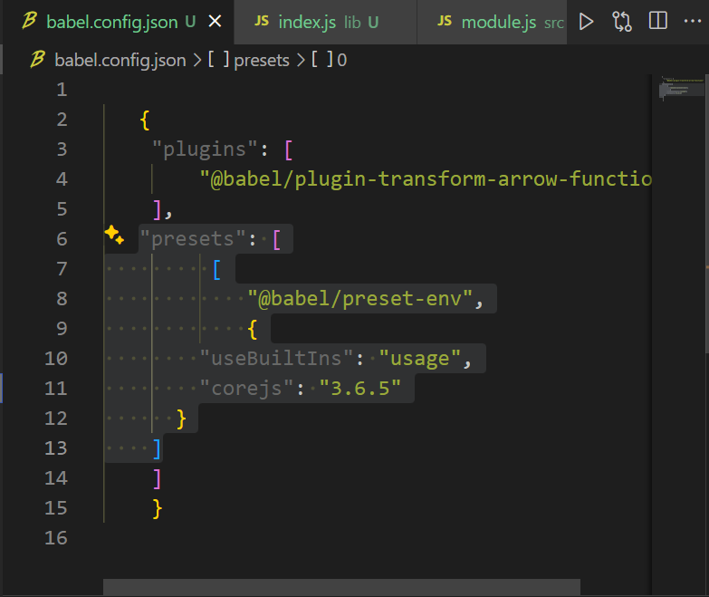
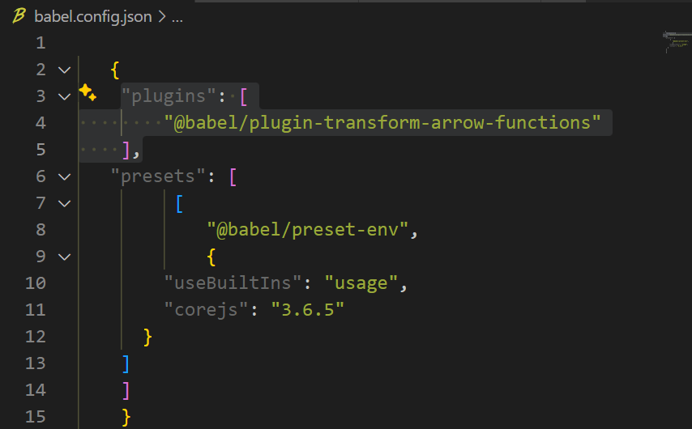
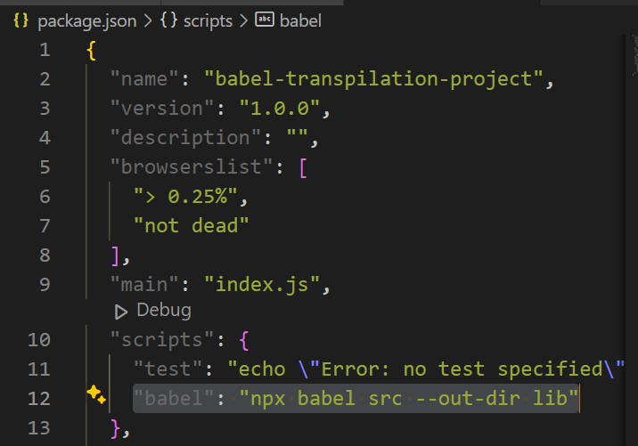
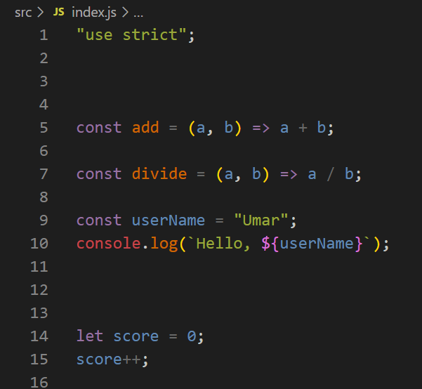
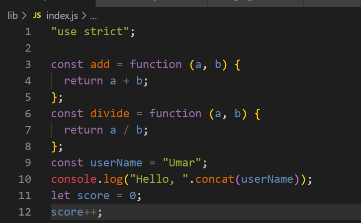

# babel-transpilation-project

# Objective
Lets solidify our understanding of Babel and its role in JavaScript transpilation by configuring Babel in a project, use ES6+ features in JavaScript code, and transpile it for broader browser compatibility.

## Purpose and functionality of transpilation:
- Transpilation is the process of converting source code from one programming language to another. In the context of JavaScript development, transpilation typically involves converting code written using newer syntax features (such as ES6 or ESNext) into equivalent code that can run in environments that might not support those features fully.

- The primary purpose of transpilation in JavaScript is to ensure compatibility with older browsers or environments that do not yet support the latest language features. Here are some key reasons why transpilation is used:

## Browser Compatibility: 
Different web browsers have varying levels of support for the latest JavaScript features. Transpilation allows developers to write code using modern syntax while ensuring it can run correctly across a wide range of browsers, including older versions.
## Forward Compatibility:
By transpiling code written using newer syntax features into older equivalents, developers can ensure that their applications remain compatible with future versions of JavaScript engines. This future-proofs the codebase and reduces the need for frequent updates as new language features are adopted.
## Developer Convenience: 
Newer syntax features often provide syntactic sugar and language improvements that can enhance developer productivity and code readability. Transpilation allows developers to take advantage of these features without worrying about compatibility issues.
## Code Optimization:
Some transpilers, like Babel, not only transpile newer syntax features but also perform optimizations to improve code performance and reduce bundle size. These optimizations can include dead code elimination, constant folding, and other techniques to make the code more efficient.
## Standardization:
Transpilation can be used to enforce coding standards and best practices across projects by converting code to a standardized format or version of the language.

##  Setup and Configuration for Transpilation:

- Initialized a new npm project and created a basic project structure including a src folder for JavaScript files.
### Installing Babel:
- Opened gitbash terminal and ran commands to
Install @babel/core, @babel/cli, and @babel/preset-env as development dependencies in  the project.

### Configure Babel:

- Created a babel.config.json file in the root of project. Configured it to use @babel/preset-env.

- In config.json file added plugins for arrow function transformation.

- In package.json file under scripts added
"babel": "npx babel src --out-dir lib" enabling the npm run babel command in terminal

## Part 2: Writing Modern JavaScript
Create JavaScript Files:

Inside the src directory, created several JavaScript files (index.js, module.js, and module2.js). Used ES6+ features such as arrow functions, template literals, const, classes, default parameters, destructuring, and modules (import/export).

### Implement Functionality:

In the terminal, executed "npm run babel" to transpile JS files from src to lib for code comapatibility across various web browsers for correct code function.

code transpilation can be monitored in lib directory's index.js file below

- src/Index.js file screenshot

lib/index.js file screenshot- transpiltaion 

